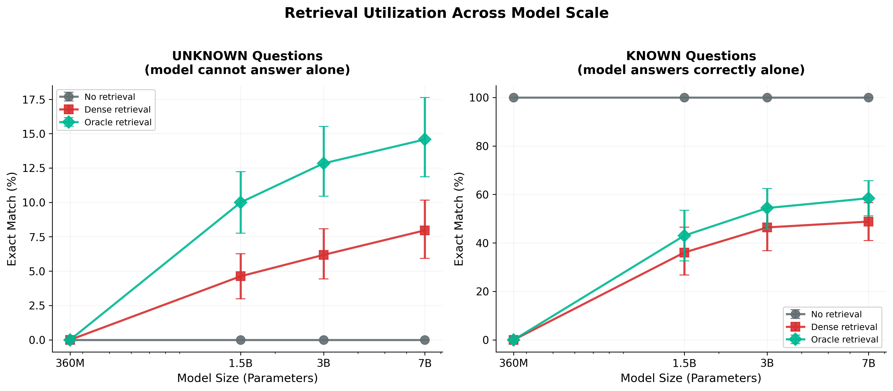
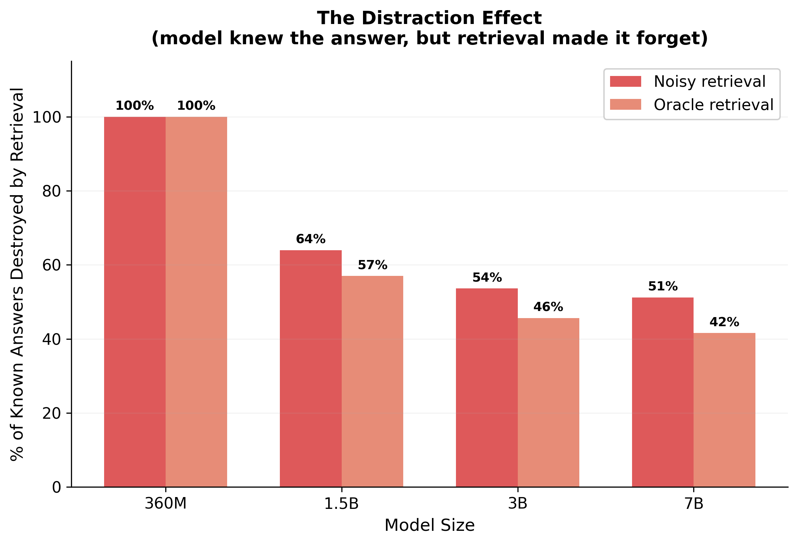

# Can Small Language Models Use What They Retrieve?

### A controlled scaling study isolating retrieval utilization from retrieval quality using oracle retrieval and parametric knowledge splits.

> **Preprint** — Under Review at ACL Rolling Review.
> This repository will be updated with the arXiv link and any revisions during review.

This repository contains the full experimental code for our study on **retrieval-augmented generation (RAG) utilization** across model scales. We investigate a core question: *when a model is given a retrieved passage containing the correct answer, does it actually use it?*

---

## Key Findings

| Finding | Result |
|---|---|
| **Oracle failure rate** | Even with the answer in the passage, models fail to extract it 85–100% of the time |
| **The distraction effect** | Noisy retrieval destroys 51–64% of answers the model already knew (≥1.5B models) |
| **Scale threshold** | Sub-1B models show zero retrieval benefit; ≥1.5B models show statistically significant gains |
| **Unknown questions** | Oracle retrieval helps unknown questions (+10–14.6pp EM for 1.5B–7B models) |
| **Known questions** | Any retrieval significantly hurts performance on questions models can answer from memory |
| **Dominant failure mode** | 61–100% of oracle failures are "irrelevant" (model ignores the passage); refusal rises with scale |

---

## Main Scaling Result

<p align="center">
  
</p>

*Figure: Exact Match across model scale for UNKNOWN (left) and KNOWN (right) questions under no retrieval, dense retrieval, and oracle retrieval. Error bars show 95% bootstrap CIs.*

---

## Repository Structure

```
rag-utilization-study/
├── src/
│   ├── utils.py                   # Shared: EM/F1/hit-rate/bootstrap CI
│   ├── 00_data_pipeline.py        # Dataset loading: NQ, HotpotQA, PopQA
│   ├── 01_bm25_retrieval.py       # BM25 index + retrieval (bm25s)
│   ├── 02_dense_retrieval.py      # E5-large-v2 embeddings + FAISS index
│   ├── 03_hybrid_retrieval.py     # Reciprocal Rank Fusion (BM25 + Dense)
│   ├── 04_scaling_grid.py         # Preliminary API grid (Groq models)
│   ├── 05_local_scaling_grid.py   # Local model grid + prompt ablation
│   ├── 06_analysis.py             # Scaling curve analysis + figures
│   ├── 07_oracle_retrieval.py     # Oracle passage construction + validation
│   ├── 08_parametric_split.py     # Known/unknown question classification
│   ├── 09_full_grid.py            # Full 4×3 grid: models × {none, noisy, oracle}
│   ├── 10_statistical_analysis.py # Bootstrap CIs, McNemar's tests, figures 1–3
│   └── 11_error_analysis.py       # Oracle failure taxonomy, figures 4–5
├── configs/
│   ├── models.yaml                # Model IDs and size mappings
│   ├── retrieval.yaml             # Retrieval hyperparameters
│   └── eval.yaml                  # Evaluation settings
├── tests/
│   ├── test_metrics.py            # Unit tests for EM/F1 computation
│   └── test_retrieval.py          # Unit tests for retrieval pipeline
├── results/
│   └── figures/                   # Generated figures (figures 1–5)
├── data/
│   └── sample/                    # 10-example fixture for smoke testing
├── reproduce.sh                   # One-command reproduction (all 9 steps)
├── requirements.txt
├── requirements-dev.txt
├── CITATION.cff
└── LICENSE
```

---

## Setup

### 1. Clone and Install

```bash
git clone https://anonymous.4open.science/r/rag-utilization-study-C67F.git
cd rag-utilization-study
pip install -r requirements.txt
pip install -r requirements-dev.txt   # for running tests
```

### 2. Verify Installation (Run Tests)

```bash
pytest tests/ -v
```

All 18 tests should pass before running experiments.

### 3. Environment Variables

```bash
# For gated HuggingFace models (Qwen)
export HF_TOKEN="your_token_here"

# For preliminary API-based experiments only (step 04 — not required for main results)
export GROQ_API_KEY="your_key_here"
```

### 4. Hardware Requirements

All experiments were run on **free-tier Kaggle T4 GPUs** (16GB VRAM).
No paid compute is required to reproduce this paper.

| Step | Hardware Used |
|---|---|---|
| BM25 retrieval (500k passages) | Kaggle T4 (CPU) |
| Dense embedding (500k passages) | Kaggle T4 GPU |
| Local model eval (4-bit, up to 7B) | Kaggle T4 GPU |
| Full pipeline (all notebooks) | Kaggle T4 GPU |

---

## Reproducing the Paper Results

### Quickstart (one command)

```bash
bash reproduce.sh
```

### Full Pipeline (step by step)

**Step 1 — Build the dataset**
```bash
python src/00_data_pipeline.py --output_dir data/
```

**Step 2 — Build Wikipedia corpus + BM25 retrieval**
```bash
python src/01_bm25_retrieval.py \
  --eval_path data/eval.jsonl \
  --corpus_output data/corpus/wiki_500k.parquet \
  --bm25_results data/results/bm25_eval_results.jsonl
```

**Step 3 — Dense retrieval with E5-large-v2**
```bash
python src/02_dense_retrieval.py \
  --corpus_path data/corpus/wiki_500k.parquet \
  --eval_path data/eval.jsonl \
  --embeddings_dir data/embeddings/ \
  --results_path data/results/dense_eval_results.jsonl
```

**Step 4 — Hybrid retrieval (RRF)**
```bash
python src/03_hybrid_retrieval.py \
  --bm25_results data/results/bm25_eval_results.jsonl \
  --dense_results data/results/dense_eval_results.jsonl \
  --output data/results/hybrid_eval_results.jsonl
```

**Step 5 — Oracle passage construction**
```bash
python src/07_oracle_retrieval.py \
  --eval_path data/eval.jsonl \
  --corpus_path data/corpus/wiki_500k.parquet \
  --dense_results data/results/dense_eval_results.jsonl \
  --output data/results/oracle_eval_results.jsonl
```

**Step 6 — Classify parametric knowledge (known/unknown)**
```bash
python src/08_parametric_split.py \
  --eval_path data/eval.jsonl \
  --none_preds_dir data/none_predictions/ \
  --output data/parametric_splits.json
```

**Step 7 — Full evaluation grid**
```bash
python src/09_full_grid.py \
  --eval_path data/eval.jsonl \
  --oracle_path data/results/oracle_eval_results.jsonl \
  --dense_path data/results/dense_eval_results.jsonl \
  --parametric_path data/parametric_splits.json \
  --none_preds_dir data/none_predictions/ \
  --output_dir data/grid_v2/
```

**Step 8 — Statistical analysis + figures 1–3**
```bash
python src/10_statistical_analysis.py \
  --grid_path data/grid_v2/full_grid_v2.csv \
  --corpus_only_path data/grid_v2/corpus_only_grid_v2.csv \
  --output_dir results/figures/
```

**Step 9 — Error taxonomy + figures 4–5**
```bash
python src/11_error_analysis.py \
  --corpus_only_path data/grid_v2/corpus_only_grid_v2.csv \
  --oracle_path data/results/oracle_eval_results.jsonl \
  --output_dir results/figures/
```

---

## Main Results

### Table 1: Exact Match (%) — Corpus-Only Oracle

**UNKNOWN questions** (model cannot answer without retrieval, n=745)

| Retrieval | 360M | 1.5B | 3B | 7B |
|---|---|---|---|---|
| None | 0.0 | 0.0 | 0.0 | 0.0 |
| Noisy (Dense) | 0.0 | 4.6 | 6.2 | 8.0 |
| **Oracle** | **0.0** | **10.0** | **12.8** | **14.6** |

**KNOWN questions** (model already knows the answer, n=11–224)

| Retrieval | 360M | 1.5B | 3B | 7B |
|---|---|---|---|---|
| None | 100.0 | 100.0 | 100.0 | 100.0 |
| Noisy (Dense) | 0.0 | 36.0 | 46.4 | 48.8 |
| Oracle | 0.0 | 43.0 | 54.4 | 58.4 |

### The Distraction Effect

<p align="center">
  
</p>

*Figure: Percentage of previously correct (KNOWN) answers destroyed by retrieval. Even oracle retrieval causes 42–100% knowledge loss.*

### Retrieval Comparison (all questions, Hit@k)

| Method | @1 | @5 | @10 | @20 |
|---|---|---|---|---|
| BM25 | 4.9% | 10.5% | 13.1% | 16.9% |
| Dense (E5-large-v2) | 8.7% | 16.3% | 19.5% | 22.9% |
| Hybrid (RRF) | 6.2% | 14.9% | 19.0% | 21.9% |
| **Oracle** | **100%** | **100%** | **100%** | **100%** |

### Oracle Failure Taxonomy (% of failures, UNKNOWN questions)

| Error Category | 360M | 1.5B | 3B | 7B |
|---|---|---|---|---|
| Irrelevant | 100 | 64 | 73 | 61 |
| Refusal | 0 | 20 | 7 | 24 |
| Wrong Entity | 0 | 6 | 8 | 4 |
| Verbose OK | 0 | 5 | 6 | 4 |
| Extraction | 0 | 3 | 4 | 3 |
| Partial Match | 0 | 2 | 2 | 3 |

---

## Datasets

| Dataset | Type | Train | Eval |
|---|---|---|---|
| [NQ-Open](https://huggingface.co/datasets/nq_open) | Factoid | 2,000 | 500 |
| [HotpotQA](https://huggingface.co/datasets/hotpot_qa) | Multi-hop | 2,000 | 500 |
| [PopQA](https://huggingface.co/datasets/akariasai/PopQA) | Long-tail | 1,000 | 500 |

Retrieval corpus: 500,000 passages sampled from [Wikipedia (2023-11-01)](https://huggingface.co/datasets/wikimedia/wikipedia).

> **Note on PopQA:** This dataset shows 0% hit rate under all retrieval conditions with our 500k-passage corpus, and is excluded from the main results (NQ + HotpotQA only). It is retained in the data pipeline for completeness.

---

## Models

### Local Models (main experiments)
| Name | Parameters | Source |
|---|---|---|
| SmolLM2-360M-Instruct | 360M | HuggingFaceTB |
| Qwen2.5-1.5B-Instruct | 1.5B | Qwen |
| Qwen2.5-3B-Instruct | 3B | Qwen |
| Qwen2.5-7B-Instruct | 7B | Qwen |

All local models are loaded in 4-bit NF4 quantization via BitsAndBytes. A CUDA-capable GPU is required.

### API Models (preliminary grid, step 04 only)
| Name | Provider |
|---|---|
| llama-3.1-8b-instant | Groq |
| llama-3.3-70b-versatile | Groq |

### Retrieval Model
- **Dense encoder**: [intfloat/e5-large-v2](https://huggingface.co/intfloat/e5-large-v2) (1024-dim)
- **Index**: FAISS `IndexFlatIP` with L2-normalised embeddings

---

## Evaluation Metrics

- **Exact Match (EM)**: Normalised token-level exact match (lowercased, punctuation removed, articles removed)
- **Token-level F1**: Best F1 against any gold answer
- **Hit@k**: Whether any gold answer string appears in the top-k retrieved passages
- **Statistical significance**: McNemar's test with Bonferroni correction (α = 0.05/24 = 0.0021)
- **Confidence intervals**: Bootstrap CIs (n=2000, 95%)

---

## Citation

This paper is currently under review. If you use this code or data, please cite:

```bibtex
@unpublished{anonymous2026smalllmrag,
  title   = {Can Small Language Models Use What They Retrieve?},
  author  = {Anonymous},
  year    = {2026},
  note    = {Under Review},
}
```

---

## License

This code is released under the MIT License. See [LICENSE](LICENSE) for details.

Dataset usage is subject to the terms of the original dataset licenses (Apache 2.0 for NQ-Open; CC BY-SA 4.0 for HotpotQA and Wikipedia).
